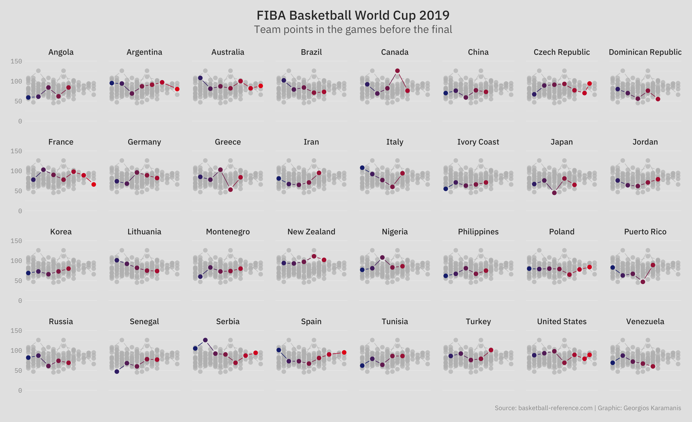

# 2019 FIBA Basketball World Cup  
Data from the 18th tournament of the FIBA Basketball World Cup for men's national basketball teams  
Spanish translation by [Julio Spairani](https://github.com/jas1)  

## R  
`scrape.R:` Code for scraping and cleaning rosters  
`scrape-results.R:` Code for scraping and cleaning results  
`scrape-playerstats.R:` Code for scraping and cleaning player stats  

---  

`height.R:` Height distribution  
`height-dist.R:` Height distribution  
`age-dist.R:` Age distribution  
`shooting-stats.R:` First round shooting percentages  
`teampoints-perc.R:` Players with most team points  
`teampoints-game.R:` Team points in all the games before the final

## Data  
`FIBA-WBC19-rosters.csv:` Rosters scraped from [Wikipedia](https://en.m.wikipedia.org/wiki/2019_FIBA_Basketball_World_Cup_squads) (accessed 2019-08-31)  
`FIBA-WBC19-results.csv:` Results scraped from [Basketball reference](https://www.basketball-reference.com) (accessed 2019-09-18)  
`FIBA-WBC19-totalteamstats.csv:` Total team statistics saved as csv from [Basketball reference](https://www.basketball-reference.com) (accessed 2019-09-18)  
`FIBA-WBC19-playerstats.csv:` Player statistics saved as csv from [Basketball reference](https://www.basketball-reference.com) (accessed 2019-09-18)  
`FIBA-WBC19-venues.csv:` Venues of the 2019 Tournament  
`FIBA-WBC19-history.csv:` Winners of previous tournaments  

### TODO  
create data dictionary

## Figures  

 
  

    
    
    
  

  

    
